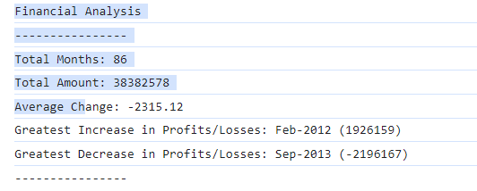

# Console-Finances
In this challenge, I create code for analyzing the financial records of a company. I was provided with a financial dataset.

## Project Description
My task is to write JavaScript code that analyzes the records to calculate each of the following:

* The total number of months included in the dataset.

* The net total amount of Profit/Losses over the entire period.

* The average of the **changes** in Profit/Losses over the entire period.
 

* The greatest increase in Profit/Losses (date and amount) over the entire period.

* The greatest decrease in Profit/Losses (date and amount) over the entire period.

## How to Install and Run the Project
Download Zip file, unzip and open index.html file in browser and right click to inspect the source code and go to the console area.

## How to Use the Project

Use as example for financial calculation

## License
MIT License

## Resources
https://www.w3schools.com/jsref/jsref_round.asp

## Screenshot

## Deployed Application
https://github.com/divine2192/Console-Finances

## Copyright
​© 2023 edX Boot Camps LLC. Confidential and Proprietary. All Rights Reserved.